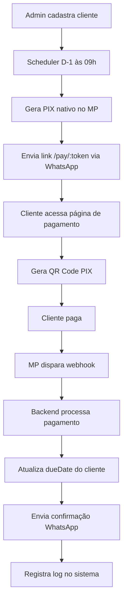

# wapassist — Sistema de Gestão de Assinaturas IPTV

> Dashboard web privada para gerenciar clientes, cobranças automáticas via PIX e notificações via WhatsApp.

[](https://adminwapassist.yootiq.com)
[](https://wapassist-api.onrender.com)
[](https://wapassist-dashboard.vercel.app)

---

## 📋 Sobre o Projeto

O **wapassist** é uma aplicação web completa para gerenciar operações de IPTV com foco em automação de cobranças e comunicação com clientes via WhatsApp. Sistema privado de uso pessoal, otimizado para gerenciar até 100 clientes.

### ✨ Funcionalidades Principais

- 🔄 **Cobrança automática D-1** antes do vencimento via WhatsApp
- 💳 **PIX nativo** do Mercado Pago com QR Code
- ✅ **Confirmação automática** de pagamento via webhook
- 📅 **Calendário** com eventos, tarefas e recorrências
- 📊 **Dashboard** com KPIs e visão geral do negócio
- 📱 **WhatsApp** integrado via Evolution API
- 🔐 **Autenticação** JWT simples e segura
- 📝 **Logs** completos de todas as operações
- 🎨 **Templates** customizáveis de mensagens

---

## 🏗️ Arquitetura

### Repositórios

```
wapassist/              → Documentação técnica completa
wapassist-api/          → Backend (Node.js + Fastify + Prisma)
wapassist-dashboard/    → Frontend (React + Vite + TailwindCSS)
```

### Stack Tecnológica

| Camada | Tecnologia | Versão | Hospedagem |
|--------|-----------|--------|------------|
| **Frontend** | React + Vite + TailwindCSS | 19 / 7 / 3 | Vercel |
| **Backend** | Node.js + Fastify + Prisma | 22 / 5 / 5.22 | Render |
| **Banco** | PostgreSQL (Neon.tech) | 16 | AWS sa-east-1 |
| **Pagamentos** | Mercado Pago PIX | v2 | — |
| **WhatsApp** | Evolution API | latest | VPS própria |
| **Scheduler** | node-cron | v4 | Embutido |

---

## 🌐 URLs de Produção

| Serviço | URL | Status |
|---------|-----|--------|
| **Dashboard** | https://adminwapassist.yootiq.com | ✅ Live |
| **Backend API** | https://wapassist-api.onrender.com | ✅ Live |
| **Health Check** | https://wapassist-api.onrender.com/health | ✅ OK |
| **Webhook MP** | https://wapassist-api.onrender.com/api/webhook/mercadopago | ✅ OK |
| **Evolution API** | https://apiwapassist.yootiq.com | ✅ Live |
| **Página de Pagamento** | https://adminwapassist.yootiq.com/pay/:token | ✅ Live |

---

## 📊 Fluxo Completo do Sistema



---

## 🗂️ Estrutura da Documentação

| Documento | Descrição |
|-----------|----------|
| [`00-PROJECT-OVERVIEW.md`](docs/00-PROJECT-OVERVIEW.md) | Visão geral, stack, custos e roadmap |
| [`01-INFRASTRUCTURE.md`](docs/01-INFRASTRUCTURE.md) | VPS, Docker, Evolution API, SSL |
| [`02-DATABASE.md`](docs/02-DATABASE.md) | PostgreSQL, schema Prisma, migrations |
| [`03-BACKEND.md`](docs/03-BACKEND.md) | API REST, rotas, serviços, scheduler |
| [`04-FRONTEND.md`](docs/04-FRONTEND.md) | Dashboard React, design system, telas |
| [`05-INTEGRATIONS.md`](docs/05-INTEGRATIONS.md) | Mercado Pago, WhatsApp, templates |
| [`06-CALENDAR.md`](docs/06-CALENDAR.md) | Calendário, eventos, recorrências |
| [`07-PHASE-AI.md`](docs/07-PHASE-AI.md) | Fase futura: IA com GPT + Whisper |
| [`08-DEPLOY.md`](docs/08-DEPLOY.md) | Deploy Render + Vercel, CI/CD |
| [`09-IMPLEMENTATION-CHECKLIST.md`](docs/09-IMPLEMENTATION-CHECKLIST.md) | Checklist completo de implementação |
| [`10-TROUBLESHOOTING.md`](docs/10-TROUBLESHOOTING.md) | Problemas conhecidos e soluções |

---

## 🚀 Quick Start

### Backend

```bash
cd wapassist-api
npm install
cp .env.example .env
# Preencher variáveis de ambiente
npx prisma db push
npx prisma generate
npm run dev
```

### Frontend

```bash
cd wapassist-dashboard
npm install
cp .env.example .env.local
# Configurar VITE_API_URL
npm run dev
```

---

## 🔑 Variáveis de Ambiente Essenciais

### Backend (`.env`)

```env
DATABASE_URL=postgresql://...
DIRECT_URL=postgresql://...  # sem pooler, para migrations
JWT_SECRET=<openssl rand -hex 32>
ADMIN_PASSWORD=<senha forte>
ADMIN_PHONE=5522997309370
MP_ACCESS_TOKEN=APP_USR-...
MP_WEBHOOK_SECRET=...
EVOLUTION_URL=https://apiwapassist.yootiq.com
EVOLUTION_APIKEY=...
EVOLUTION_INSTANCE=wapassist
FRONTEND_URL=https://adminwapassist.yootiq.com
PORT=3000
```

### Frontend (`.env.local`)

```env
VITE_API_URL=https://wapassist-api.onrender.com
```

---

## 📡 API Endpoints

### Autenticação
- `POST /api/auth/login` — Login com senha, retorna JWT

### Clientes
- `GET /api/clients` — Lista clientes (filtros: status, plan, search)
- `GET /api/clients/:id` — Detalhe do cliente
- `POST /api/clients` — Cadastrar cliente
- `PUT /api/clients/:id` — Atualizar cliente
- `DELETE /api/clients/:id` — Deletar cliente
- `POST /api/clients/:id/send-billing` — Enviar cobrança manual
- `POST /api/clients/:id/send-confirmation` — Confirmar pagamento manual
- `GET /api/clients/:id/logs` — Logs do cliente

### Pagamentos
- `GET /api/payments` — Histórico de pagamentos
- `POST /api/webhook/mercadopago` — Webhook do Mercado Pago
- `GET /pay/:token` — Info do cliente para página de pagamento
- `POST /pay/:token/pix` — Gerar PIX nativo

### Dashboard
- `GET /api/dashboard/summary` — KPIs e resumo
- `GET /api/whatsapp/status` — Status da conexão WhatsApp

### Calendário
- `GET /api/events` — Lista eventos
- `POST /api/events` — Criar evento
- `PUT /api/events/:id` — Atualizar evento
- `DELETE /api/events/:id` — Deletar evento

### Logs
- `GET /api/logs` — Logs do sistema

### Notas
- `POST /api/notes` — Criar nota
- `DELETE /api/notes/:id` — Deletar nota

---

## 🤖 Jobs Automáticos (Scheduler)

| Job | Horário | Função |
|-----|---------|--------|
| **Cobrança D-1** | 09:00 diário | Envia cobrança para clientes que vencem amanhã |
| **Inadimplência** | 10:00 diário | Marca clientes como OVERDUE após 3 dias |
| **Notificações** | A cada 5 min | Envia notificações de eventos do calendário |
| **Recorrências** | 07:00 segundas | Expande eventos recorrentes para 90 dias |

---

## 💰 Custo Mensal Estimado

| Serviço | Custo |
|---------|-------|
| VPS (Evolution API) | R$ 20-25 |
| Render (Backend) | R$ 0 (free tier) |
| Vercel (Frontend) | R$ 0 (free tier) |
| Neon.tech (PostgreSQL) | R$ 0 (free tier) |
| Mercado Pago | ~0,99% por transação |
| **Total (30 clientes)** | **~R$ 30/mês** |

---

## 🔒 Segurança

- ✅ JWT com expiração de 7 dias
- ✅ Validação HMAC-SHA256 no webhook do Mercado Pago
- ✅ CORS configurado apenas para domínio do frontend
- ✅ Variáveis sensíveis nunca commitadas
- ✅ HTTPS em todos os serviços
- ✅ Deduplicação de pagamentos por `mpPaymentId`

---

## 📝 Regra de Negócio Central

### Cálculo da Nova Data de Vencimento

```javascript
SE cliente pagou ANTES ou NO DIA do vencimento:
    nova_data = due_date_atual + dias_do_plano

SE cliente pagou DEPOIS do vencimento:
    nova_data = data_do_pagamento + dias_do_plano
```

### Dias por Plano

| Plano | Enum | Dias | Preço Padrão |
|-------|------|------|-------------|
| Mensal | `MONTHLY` | 30 | R$ 30 |
| Trimestral | `QUARTERLY` | 90 | R$ 80 |
| Semestral | `SEMIANNUAL` | 180 | R$ 150 |
| Anual | `ANNUAL` | 365 | R$ 280 |

---

## 🎯 Roadmap

- [x] **MVP (Fase 1)** — Dashboard CRUD, PIX automático, WhatsApp
- [x] **Calendário** — Eventos, tarefas, recorrências
- [x] **Templates** — Gerenciamento de mensagens WhatsApp
- [x] **Logs** — Auditoria completa do sistema
- [ ] **Fase 2** — Relatórios financeiros, múltiplos links PIX
- [ ] **Fase 3 — IA** — Comandos por voz/texto no WhatsApp

---

## 🛠️ Manutenção

### Logs do Backend (Render)
Acesse o painel do Render → Logs

### Logs da Evolution API (VPS)
```bash
ssh root@IP_DA_VPS
docker logs evolution_api --tail 50 --follow
```

### Reescanear QR Code WhatsApp
Acesse a dashboard → Ícone de configurações → Status WhatsApp

### Monitoramento
- **UptimeRobot**: Monitor ID 802393905, ping a cada 5 min
- **Health check**: https://wapassist-api.onrender.com/health

---

## 📄 Licença

Projeto privado de uso pessoal.

---

## 👤 Autor

Desenvolvido para gerenciamento de operação IPTV.

---

## 🔗 Links Úteis

- [Mercado Pago Developers](https://www.mercadopago.com.br/developers)
- [Evolution API Docs](https://doc.evolution-api.com)
- [Prisma Docs](https://www.prisma.io/docs)
- [Fastify Docs](https://www.fastify.io)
- [React Query Docs](https://tanstack.com/query)
